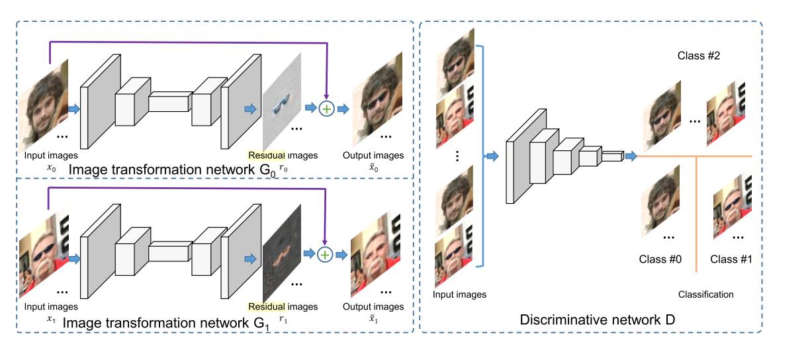
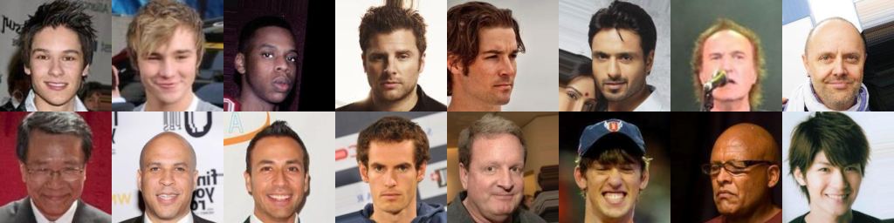
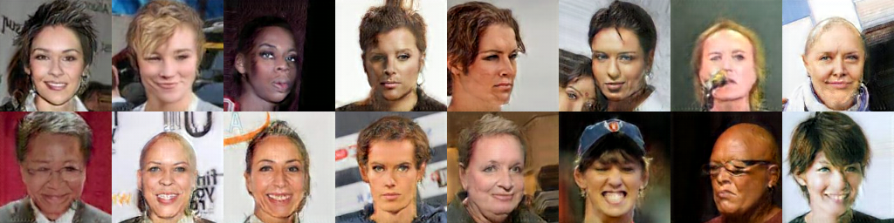
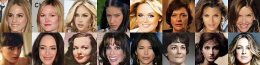
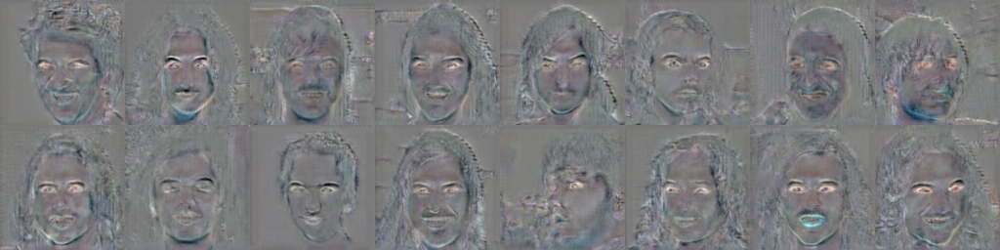
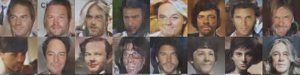

# Residual_Image_Learning_GAN
Tensorflow Implement of Paper [Learning Residual Images for Face Attribute Manipulation](https://arxiv.org/abs/1612.05363), which has been accepted in CVPR 2017. We need write this code and compare our results with that, because the author don't public their code. I think this paper is a good paper and they give a perfect idea for facial visual manipulating with images residual learning.

## Prerequisites

+ [Tensorflow](http://tensorflow.org/)

## Datasets
We use the [CelebA](http://mmlab.ie.cuhk.edu.hk/projects/CelebA.html) datasets and crop images to 64x64.

---------------------------------------------
The training data folder should look like : 
<train_data_root>
                |--image1
                |--image2
                |--image3
                |--image4...
---------------------------------------------

## Running

  $ python main.py --IMAGE_PATH /home/?/data/celebA/
 
## Experiments

The man face:

The residual face:

Man-to-Woman Face:

--------------------

The woman face:

The residual face:

Woman-to-Man Face:

## Acknowledgement
+ [DCGAN-tensorflow](https://github.com/carpedm20/DCGAN-tensorflow)
